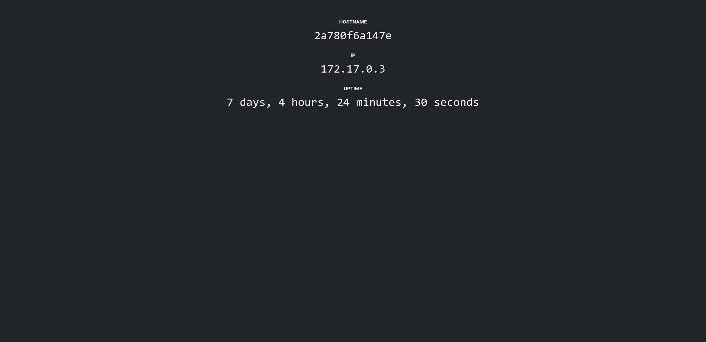

# Simple Dashboard
A docker container that runs a simple Node.js app showing the hostname, IP address, and uptime.

## Installation
```
git clone https://github.com/milesrack/simple-dashboard
cd simple-dashboard
```

## Usage
First build the docker image:
```
docker run -p 3000:3000 -d simple-dashboard
```

After building the image run it in a container:
```
docker run -p 3000:3000 -d simple-dashboard:latest
```

Now the app will be running at http://localhost:3000

## Screenshot

